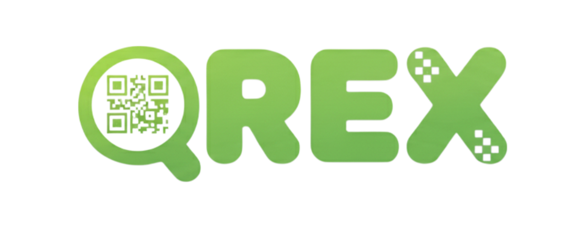

# 💻 QRex Frontend Client

<div align="center">
  
  <h3>🛡️ AI 기반 지능형 QR/URL 피싱 탐지 플랫폼</h3>
  <p>
    QRex는 사용자가 QR코드를 스캔하거나 URL을 입력했을 때,<br/>
    AI 에이전트와 RAG(검색 증강 생성) 기술을 통해 피싱 위협을 분석하고 안전한 인터넷 환경을 제공하는 웹 서비스입니다.
  </p>
</div>

---

## 🚀 Key Features

### 1. 🔍 QR Code & URL Analysis (Core)
- **다양한 입력 방식:** 카메라를 통한 실시간 스캔, 이미지 파일 업로드, URL 직접 입력을 지원합니다.
- **클라이언트 사이드 처리:** `jsQR`을 활용하여 서버 전송 전 브라우저에서 즉시 QR 데이터를 추출합니다.
- **이미지 최적화:** `heic2any`를 도입하여 아이폰(HEIC) 이미지도 자동으로 변환하여 처리합니다.
- **분석 리포트:** AI가 분석한 위험 단계(SAFE/DANGEROUS)와 상세 근거를 시각적인 대시보드로 제공합니다.

### 2. 🤖 AI Security Agent
- **실시간 채팅:** 화면 우측 하단 플로팅 버튼을 통해 언제든 보안 에이전트와 대화할 수 있습니다.
- **스트리밍 응답:** 분석 결과나 보안 가이드를 대화형 인터페이스로 제공합니다.
- **컨텍스트 유지:** 로그인 사용자별 대화 세션을 유지하여 개인화된 경험을 제공합니다.

### 3. 👥 Community & Knowledge Sharing
- **게시판 시스템:** 최신 피싱 사례를 공유하고 토론할 수 있는 커뮤니티입니다.
- **반응형 UI:** PC에서는 `Resizable Panel`을 통해 목록과 상세 내용을 동시에 보고, 모바일에서는 탭 방식으로 최적화된 UX를 제공합니다.
- **신고 및 관리:** 악성 게시글/댓글 신고 기능 및 작성자 본인의 삭제 기능을 포함합니다.

### 4. 🔐 Authentication & Security
- **JWT 인증:** Access Token 기반의 보안 로그인 및 자동 만료 감지(Interceptor) 로직이 적용되어 있습니다.
- **OAuth 2.0:** Google, Kakao 소셜 로그인을 완벽하게 지원합니다.
- **이중 보안:** 비밀번호 변경 및 회원 탈퇴 시 재검증 절차를 수행합니다.

---

## 🛠 Tech Stack

| Category | Technology | Description |
| :--- | :--- | :--- |
| **Framework** | **React 18** | 컴포넌트 기반 UI 구축 |
| **Build Tool** | **Vite** | 초고속 개발 서버 및 빌드 최적화 |
| **Styling** | **Tailwind CSS v4** | 유틸리티 퍼스트 스타일링 |
| **UI Library** | **Shadcn UI** | Radix UI 기반의 재사용 가능한 컴포넌트 (Dialog, Sheet, Drawer 등) |
| **Animation** | **Framer Motion** | 자연스러운 화면 전환 및 인터랙션 애니메이션 |
| **State Mgt** | **Context API** | 전역 인증(Auth) 상태 관리 |
| **Network** | **Axios** | 인터셉터를 활용한 HTTP 통신 및 에러 핸들링 |
| **Utilities** | `jsQR`, `heic2any`, `lucide-react`, `sonner` | QR 스캔, 이미지 변환, 아이콘, 토스트 알림 |

---

## 📂 Project Structure

```bash
src
├── api             # Axios 인스턴스 및 도메인별 API 함수 (auth, community, analysis)
├── assets          # 로고, 배경 영상, 정적 이미지 리소스
├── components
│   ├── analysis    # 분석 관련 컴포넌트 (QRScanPanel, ResultPanel, History)
│   ├── chat        # AI 챗봇 위젯 및 채팅방 로직
│   ├── common      # 공통 UI (Header, AuthPopup, CustomDialog, LoadingBar)
│   ├── community   # 게시판, 글쓰기, 댓글 드로어(Drawer)
│   ├── ui          # Shadcn UI 베이스 컴포넌트 (Button, Input, Card 등)
│   └── icons       # 커스텀 아이콘 (KakaoIcon 등)
├── contexts        # AuthContext (로그인 상태 전역 관리)
├── hooks           # 커스텀 훅 (useAuth)
├── pages           # 라우트 페이지 (Home, Login, Analysis, Community...)
├── lib             # 유틸리티 (tailwind-merge 등)
└── utils           # 토큰 관리, 스크롤 잠금 등 헬퍼 함수
```

---

## 🔌 API Integration Logic

본 프로젝트는 백엔드와의 통신을 위해 **Axios Interceptor**를 사용하여 보안성과 사용자 경험을 강화했습니다.

1.  **Request:**
    - `localStorage`에 저장된 JWT 토큰을 자동으로 Header(`Authorization: Bearer ...`)에 주입합니다.
2.  **Response:**
    - **401 Unauthorized** 발생 시 토큰 만료로 간주하여 즉시 로그아웃 처리합니다.
    - 글로벌 이벤트(`qrex-token-expired`)를 발생시켜 사용자에게 **로그인 팝업을 강제로** 띄워, 작업 흐름이 끊기지 않도록 유도합니다.

---

## 📱 Screenshots & UX Details

### 1. Landing Page & Animations
- **Video Background:** `framer-motion`을 활용한 부드러운 스크롤 애니메이션과 고화질 영상 배경을 적용하여 몰입감을 높였습니다.
- **Scroll Lock:** 모바일 환경에서의 매끄러운 사용자 경험을 위해 브라우저 확대/축소 방지 및 스크롤 제어 로직(`scrollLock.js`)을 직접 구현했습니다.

### 2. Split View Dashboard
- **Resizable Panel:** PC 환경에서는 **Analysis**와 **Community** 페이지에서 좌우 패널 크기를 마우스로 자유롭게 조절할 수 있는 Split View를 제공하여 생산성을 높였습니다.

---

### 👨‍💻 Developer

- **Frontend Engineer:** 김여민
- **Contact:** [이메일 주소를 입력하세요]
- **Team:** 404 FOUND (Chungbuk National Univ.)
